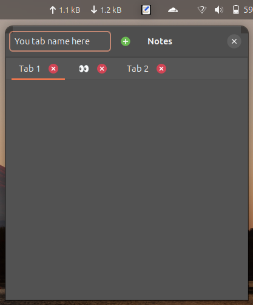
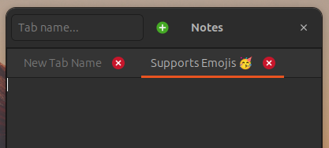
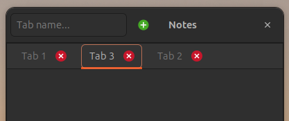
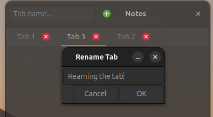

# QuickNotes — 📝 Notes Tray App for Linux

A minimal, beautiful **Linux tray app for quick notes**, built with **GTK 3 (PyGObject)**.  
Supports **tabbed notes**, emoji labels, drag-to-sort, and persistent storage in JSON.



---

## ✨ Features

- 🖼️ **Tabbed Notes UI** – Easily create and switch between notes
- 🥳 **Emoji Tab Names** – Use emojis to visually label your tabs (e.g., 🛒 for shopping)
- 🖱️ **Drag and Drop Tab Sorting** – Rearrange tabs by dragging
- 📝 **Rename Tabs** – Right-click tab to rename
- 💾 **Persistent Storage** – Notes saved automatically to `~/.local/share/notes`

---

## 📦 Installation

```bash
git clone https://github.com/avinash90000/QuickNotes.git
cd quickNotes
python3 main.py
```

## 📷 Screenshots





`Drag to sort/reorder the tabs`



`Double click the note you want to rename`
